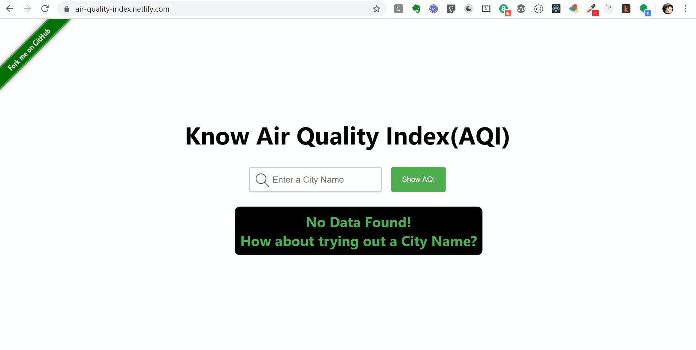

# Project `aqi-react`
aqi-react is a project created to know the Air Quality Index of various parts of the world. 

This project was bootstrapped with [Create React App](https://github.com/facebook/create-react-app) to create the frond-end User Interfaces using ReactJs. At the backend, [Air Quality Programmatic APIs](https://aqicn.org/api/) are used to get the details of the Air Quality.

# What is Air Quality Index(AQI)
An air quality index (AQI) is used by government agencies to communicate to the public how polluted the air currently is or how polluted it is forecast to become. 

Public health risks increase as the AQI rises. Different countries have their own air quality indices, corresponding to different national air quality standards. More details can be found [here](https://en.wikipedia.org/wiki/Air_quality_index).

# Why is this project Important?
This project was created as a pet project to explain the concepts of reactjs. It has nothing commercial about it. It is with pure learn and share objecives.

One can learn following concepts of reactJs:
- React Hook Concepts using, `useState`, `useEffect`, `useRef` etc.
- Uasage of React Forms with Controlled Component
- Show-Hide component in React
- Passing Props

# Demo
A Demo of the project [is running here](https://air-quality-index.netlify.com/).

# See it in Action

# Running the Project

In the project directory, you can run:

## `yarn install`
Install the dependencies.

## `yarn start`

Runs the app in the development mode. 
Open [http://localhost:3000](http://localhost:3000) to view it in the browser.

The page will reload if you make edits. 
You will also see any lint errors in the console.

## `yarn build`

Builds the app for production to the `build` folder. 
It correctly bundles React in production mode and optimizes the build for the best performance.

The build is minified and the filenames include the hashes. 
Your app is ready to be deployed!

To learn React, check out the [React documentation](https://reactjs.org/).

# Deployment Status

Liked what I do? Thank You Very Much!

